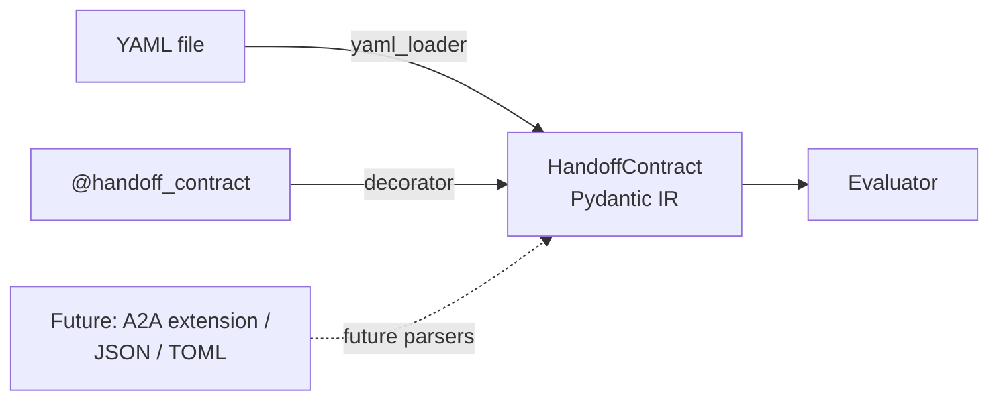

# ADR 0001: Contract intermediate representation with multiple frontends

- **Status:** Accepted
- **Date:** 2026-04-21
- **Deciders:** Gian Prem Rajaram
- **Related tickets:** PRC-005 (this ADR), PRC-006 (IR schema), PRC-007 (YAML frontend), PRC-008 (decorator frontend), PRC-013 (evaluator)

## Context

Precept's MVP supports two contract declaration surfaces:

1. **YAML files** — artefact-bearing, reviewable by compliance owners and external stakeholders who do not read Python.
2. **Python decorators** (`@handoff_contract`) — developer ergonomics, contract lives next to the agent node that produces the handoff.

A third frontend is foreseeable in Phase 2: an A2A protocol extension that would embed a contract in an Agent Card (PRC-032). Further frontends (JSON, TOML, or editor-generated formats) are not ruled out.

Without a shared representation, each frontend would grow its own internal model, duplicating field definitions, validation rules, and defaults. The evaluation engine would either couple to one frontend's shape or carry a branching translation layer. Both outcomes decay quickly: frontends drift, validation diverges, tests multiply, and the engine accrues frontend-specific concessions that will remain long after the frontends that motivated them.

## Decision

Adopt a **single Pydantic intermediate representation (IR)**: `precept.contract.schema.HandoffContract`.

- Every declaration surface is implemented as a **parser module** whose sole responsibility is to produce a `HandoffContract` instance from its input (a YAML string, decorator arguments, a future A2A payload, etc.).
- Parsers live under `src/precept/contract/` as independent modules. They do not share state and do not depend on each other.
- The evaluator (`precept.evaluation.Evaluator`, PRC-013) consumes only `HandoffContract`. It has no knowledge of YAML, decorators, or any other frontend.
- `HandoffContract` is validated by Pydantic v2 with `extra="forbid"`; typos and unknown fields fail at parse time.



ASCII fallback:

```
  YAML file ───────── yaml_loader ───────►┐
                                          │
  @handoff_contract ─ decorator ─────────►├──► HandoffContract ──► Evaluator
                                          │        (IR)
  Future (A2A/JSON/TOML) ─ future parser ►┘
```

### Empty contracts (progressive adoption)

A `HandoffContract` whose `fields.required_fields`, `fields.preserved_entities`, and `fields.forbidden_drops` are all empty is a valid **scaffold / observe-only** contract. Its semantics are explicit: no rules run, no fidelity scoring runs, the contract produces no violations.

This mode exists so teams can wire contract loading, registry plumbing, and telemetry through CI before committing to specific rule content. It is **not** a fallback for misconfigured files; ambiguity here is a documented behaviour, not an accident.

Consumers relying on empty contracts should:

1. Name the contract explicitly (e.g., `scaffold_researcher_to_summariser`) so the observe-only intent is visible in logs and events.
2. Plan the transition to enforced rules as a follow-up ticket, not an open-ended deferral.

## Consequences

### Positive

- **Adding a new frontend is additive.** Implementing the A2A parser (PRC-032) is a new module that constructs a `HandoffContract`; no engine change is required.
- **The evaluator is unit-testable without a parser.** Tests construct `HandoffContract` in-memory and exercise the engine; they do not touch YAML or the decorator.
- **Validation is centralised.** The single IR carries the only schema; each parser's job is reduced to format translation.
- **Public API stability is anchored on one type.** `HandoffContract` is the semver commitment; frontend implementations can evolve internally without breaking API users.

### Negative / accepted trade-offs

- **The IR must anticipate the union of needs across frontends.** Pressure to grow the schema is concentrated in one place. This is mitigated by strict `extra="forbid"` and by routing frontend-specific optimisations into the parser rather than the IR.
- **Parsers cannot exchange information directly.** If two frontends need to share a lookup (e.g., contract-registry conventions), they must agree via the IR or a separate shared module, not via mutual imports.
- **Pydantic error messages need wrapping at each frontend boundary.** `ContractValidationError` replaces `pydantic.ValidationError` at the public API; each parser handles the wrap, and a shared `ContractValidationError.from_pydantic(...)` helper keeps the translation uniform.

## Non-goals

These are deliberately out of scope for v0 and are not consequences of this decision; they are separate design commitments documented here so they are not reopened accidentally.

- **No runtime code generation.** The IR is a Pydantic model, not a compiled artefact. No `exec`, no generated classes, no dynamic subclassing of `HandoffContract`.
- **No dynamic schema extension at v0.** Users cannot add fields to `HandoffContract` at runtime. A plugin mechanism for rule types is a Phase 2 research item, not an engine constraint.
- **No schema versioning semantics beyond an opaque string.** The `version` field is a free-form string; breaking-change semantics are deferred (see DEPENDENCIES.md section 10).

## Alternatives considered

1. **Per-frontend internal models, engine branches on type.** Rejected: duplicates validation, inflates the engine surface, and pins the engine to the set of frontends existing at the time of the branch.
2. **Shared base class, each frontend subclasses.** Rejected: subclassing invites behavioural drift and defeats `extra="forbid"`.
3. **JSON Schema as the IR.** Rejected: adds a second representation (Python objects vs schema), and Pydantic already produces JSON Schema on demand via `model_json_schema()` if an external consumer needs one.

## References

- [MADR (Markdown Architecture Decision Records)](https://adr.github.io/madr/) — format basis (used lightly).
- [ISSUES.md](../../ISSUES.md) — PRC-005, PRC-006, PRC-007, PRC-008, PRC-013.
- [DEPENDENCIES.md](../../DEPENDENCIES.md) — section 2 (dependency graph), section 5.6 (versioning).
- [CLAUDE.md](../../CLAUDE.md) — "IR-first contract architecture" under Critical architectural constraints.
